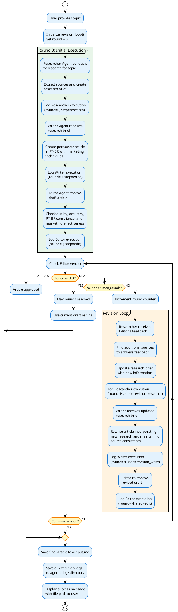

# Multi-Agent Research System - Activity Diagram (Flowchart)

This diagram shows the detailed flow of the revision loop process.

## Flow Description

### Initial Execution (Round 0)
1. **Research Phase**: Researcher agent searches the web and extracts sources
2. **Writing Phase**: Writer agent creates a persuasive PT-BR article
3. **Review Phase**: Editor agent evaluates quality and compliance

### Decision Point
- **APPROVE**: Article meets all criteria, proceed to save
- **REVISE**: Article needs improvements, enter revision loop (if rounds < max_rounds)

### Revision Loop (Rounds 1-2)
1. **Updated Research**: Researcher addresses Editor's specific feedback
2. **Rewrite**: Writer incorporates new research and revises article
3. **Re-review**: Editor evaluates the revised draft

### Loop Control
- Maximum 2 revision rounds (configurable)
- Each round is tracked and logged separately
- If max rounds reached, use the current draft as final (even if not approved)

### Output Phase
- Save final article to `output.md`
- All agent executions logged to `agents_log/` directory
- Success message displayed to user

## Key Features

- **Iterative Improvement**: Up to 2 revision cycles for quality enhancement
- **Complete Logging**: Every agent interaction is logged with round number and step identifier
- **Graceful Degradation**: System completes even if Editor never approves (after max rounds)
- **Traceability**: Full audit trail of research, writing, and editorial decisions
