# Multi-Agent Research System - Class Diagram

This diagram shows the main classes and their relationships in the system.

```plantuml
@startuml
!theme plain

package "Agno Framework" {
    class Agent {
        +name: str
        +role: str
        +model: OpenAIChat
        +tools: List[Tool]
        +instructions: str
        +markdown: bool
        --
        +run(input: str): RunOutput
    }

    class Team {
        +name: str
        +members: List[Agent]
        +markdown: bool
        --
        +run(input: str): RunOutput
    }

    class OpenAIChat {
        +id: str
        --
        +generate(prompt: str): str
    }

    class StepInput {
        +input: str
        +previous_step_outputs: str
        --
        +__init__(input: str)
    }

    class StepOutput {
        +content: str
        --
        +__init__(content: str)
    }

    class Workflow {
        +name: str
        +steps: List[Step]
        --
        +run(input: str): RunOutput
    }

    interface Tool {
        +execute(): Any
    }

    class DuckDuckGoTools implements Tool {
        +search(query: str): List[Result]
    }

    class TrafilaturaTools implements Tool {
        +extract(url: str): str
    }
}

package "Multi-Agent Research System" {

    class AgentLogger {
        +log_dir: Path
        --
        +log_agent_execution(agent_name: str, input_data: str, output_data: str, round_number: int, step: str): None
        -_create_log_entry(): dict
        -_save_to_file(data: dict): None
    }

    class ResearcherAgent {
        <<Agent>>
        +name: "Researcher"
        +role: "Web search & source extraction"
        +tools: [DuckDuckGo, Trafilatura]
        +instructions: RESEARCH_INSTRUCTIONS
        --
        +conduct_research(topic: str): str
    }

    class WriterAgent {
        <<Agent>>
        +name: "Writer"
        +role: "Marketing copywriter"
        +instructions: WRITER_INSTRUCTIONS
        --
        +write_article(brief: str, topic: str): str
    }

    class EditorAgent {
        <<Agent>>
        +name: "Editor"
        +role: "Quality control"
        +instructions: EDITOR_INSTRUCTIONS
        --
        +review_article(draft: str): str
    }

    class RevisionLoop {
        +topic: str
        +max_rounds: int
        +current_round: int
        --
        +execute(): str
        -_initial_execution(): tuple
        -_revision_cycle(verdict: str): tuple
        -_should_continue(verdict: str): bool
    }

    class AgentOrchestrator {
        <<static>>
        --
        +research_step_fn(step_input: StepInput, round_number: int): StepOutput
        +write_step_fn(step_input: StepInput, topic: str, round_number: int): StepOutput
        +edit_step_fn(step_input: StepInput, round_number: int): StepOutput
        +build_researcher(): Agent
        +build_writer(): Agent
        +build_editor(): Agent
        +assemble_team(): Team
        +build_workflow(): Workflow
    }

    class CLI {
        <<main>>
        --
        +run(topic: str): str
        +main(argv: List[str]): None
    }

    class Configuration {
        <<module>>
        +RESEARCH_INSTRUCTIONS: str
        +WRITER_INSTRUCTIONS: str
        +EDITOR_INSTRUCTIONS: str
        +OPENAI_API_KEY: str
    }

    class OutputManager {
        <<static>>
        --
        +save_article(content: str, filename: str): None
        +create_log_directory(): None
    }
}

' Relationships
Agent <|-- ResearcherAgent
Agent <|-- WriterAgent
Agent <|-- EditorAgent

Agent --> OpenAIChat : uses
Agent --> Tool : uses
Team o-- Agent : contains

RevisionLoop --> AgentOrchestrator : uses
RevisionLoop --> AgentLogger : logs to

AgentOrchestrator --> ResearcherAgent : creates
AgentOrchestrator --> WriterAgent : creates
AgentOrchestrator --> EditorAgent : creates
AgentOrchestrator --> StepInput : consumes
AgentOrchestrator --> StepOutput : produces
AgentOrchestrator --> AgentLogger : uses

CLI --> RevisionLoop : orchestrates
CLI --> OutputManager : uses

Configuration ..> AgentOrchestrator : configures
Configuration ..> ResearcherAgent : provides instructions
Configuration ..> WriterAgent : provides instructions
Configuration ..> EditorAgent : provides instructions

ResearcherAgent --> DuckDuckGoTools : uses
ResearcherAgent --> TrafilaturaTools : uses

note right of RevisionLoop
    Main workflow controller that
    manages the iterative process
    of research, writing, and editing
    with up to max_rounds revisions
end note

note bottom of AgentLogger
    Logs all agent executions to
    agents_log/ directory with:
    - Timestamp
    - Agent name
    - Round number
    - Input/Output
end note

@enduml
```

## Class Descriptions

### Agno Framework Classes
These are the core classes from the Agno framework that our system uses:

- **Agent**: Base class for all AI agents with model, tools, and instructions
- **Team**: Container for multiple agents working together
- **OpenAIChat**: Interface to OpenAI's GPT models
- **StepInput/StepOutput**: Data transfer objects for workflow steps
- **Workflow**: Sequential execution of steps
- **Tool**: Interface for agent tools (DuckDuckGo, Trafilatura, etc.)

### Custom System Classes

#### AgentLogger
Handles all logging functionality:
- Creates timestamped JSON log files
- Tracks round numbers and execution steps
- Saves complete input/output for debugging

#### Specialized Agents
- **ResearcherAgent**: Inherits from Agent, configured for web research
- **WriterAgent**: Inherits from Agent, configured for marketing copywriting
- **EditorAgent**: Inherits from Agent, configured for quality control

#### RevisionLoop
Core workflow controller:
- Manages the iterative research→write→edit process
- Controls revision rounds
- Coordinates between all agents

#### AgentOrchestrator
Static helper class containing all agent builders and step functions

#### CLI
Entry point for command-line usage

#### Configuration
Module containing all instruction prompts and environment variables

#### OutputManager
Handles file output operations

## Key Design Patterns

1. **Factory Pattern**: Agent builders (build_researcher, build_writer, build_editor)
2. **Strategy Pattern**: Different agents with different instructions and tools
3. **Observer Pattern**: Logging system observes all agent executions
4. **Template Method**: Step functions follow same pattern (execute → extract → log)
5. **Facade Pattern**: CLI provides simple interface to complex multi-agent system
