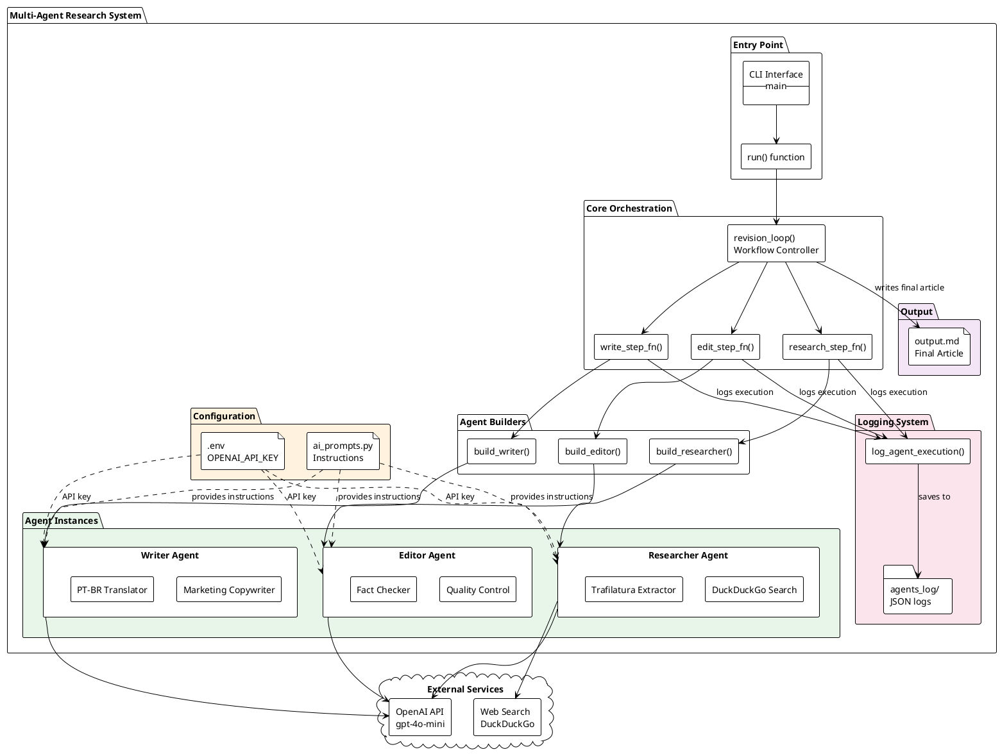

# Multi-Agent Research System - Component Diagram

This diagram shows the system architecture and component relationships.

## Component Descriptions

### Entry Point
- **CLI Interface**: Command-line entry point that accepts topic argument
- **run()**: Wrapper function that calls revision_loop with max_rounds=2

### Core Orchestration
- **revision_loop()**: Main workflow controller that orchestrates the multi-agent process
- **research_step_fn()**: Executes Researcher agent and logs results
- **write_step_fn()**: Executes Writer agent and logs results
- **edit_step_fn()**: Executes Editor agent and logs results

### Agent Builders
- **build_researcher()**: Creates Researcher agent with web tools
- **build_writer()**: Creates Writer agent with marketing instructions
- **build_editor()**: Creates Editor agent with quality control instructions

### Agent Instances
- **Researcher Agent**: Uses DuckDuckGo and Trafilatura for web research
- **Writer Agent**: Marketing-focused copywriter for PT-BR content
- **Editor Agent**: Quality control and fact-checking specialist

### Configuration
- **.env File**: Contains OpenAI API key
- **ai_prompts.py**: Contains instruction prompts for all agents

### External Services
- **OpenAI API**: GPT-4o-mini model for all agents
- **Web Search**: DuckDuckGo for finding sources

### Logging System
- **log_agent_execution()**: Logging utility function
- **agents_log/**: Directory containing JSON logs for each execution

### Output
- **output.md**: Final article in markdown format with sources

## Key Relationships

1. **Solid arrows (→)**: Direct function calls or data flow
2. **Dotted arrows (..>)**: Configuration or dependency injection
3. **Colored packages**: Logical grouping by function
   - Green: Agent instances
   - Orange: Configuration
   - Pink: Logging
   - Purple: Output
