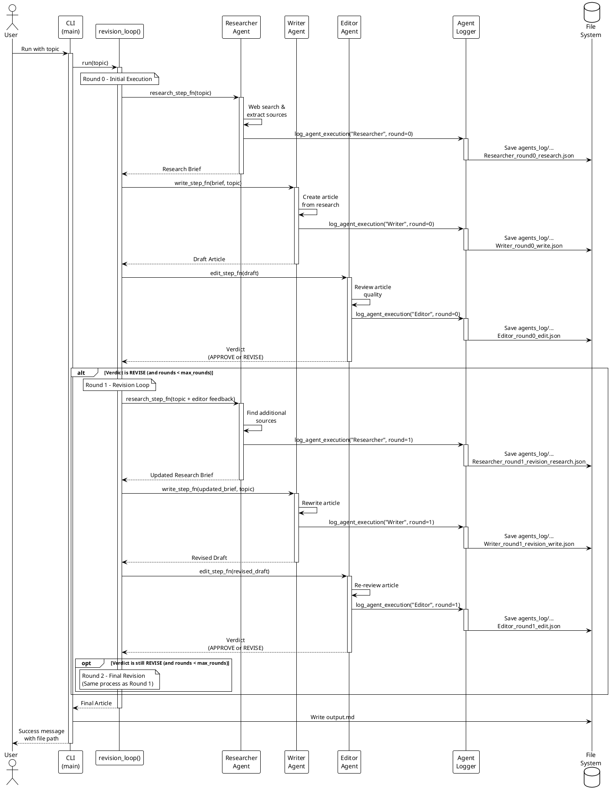

# Multi-Agent Research System - Sequence Diagram

This diagram shows the flow of execution through the multi-agent system, including the revision loop.

## Key Points

- **Round 0**: Initial research, write, and edit cycle
- **Round 1-2**: Revision cycles triggered by Editor's REVISE verdict
- **Logging**: Every agent execution is logged to `agents_log/` directory
- **Max Rounds**: Default is 2 revision rounds maximum
- **Output**: Final article saved to `output.md`

## Agent Roles

1. **Researcher**: Web search & source extraction
2. **Writer**: Marketing-focused copywriting in PT-BR
3. **Editor**: Quality control, fact-checking, and PT-BR validation
